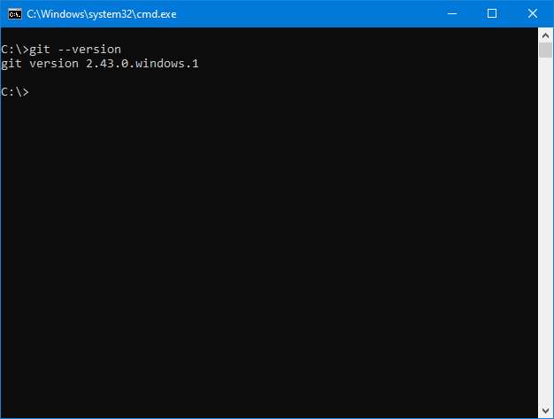

# Work-case 1: Git
В цьому ворккейсі було розглянуто питання що таке git, а також як і для чого його використовують.\
Роботу виконали студенти групи БІКС-13:\
Гринь Дмитро та Ілля Негусєв

## 1. Що таке Git?
Git – це розподілена система контролю версій, яка дозволяє відстежувати історію розробки ПЗ і спільно працювати над складними проектами з будь-якої точки світу. Git є зручним способом для розробки проектів, що дозволяє:

- спостерігати за змінами в коді та виправляти помилки;
- співпрацювати над одним проектом з іншими розробниками; 
- безпечно відновлювати видалені файли та повертати зміни.

Цю систему розробив Лінус Торвальдс у 2005 році для керування розробкою ядра операційної системи Linux. Як і Linux, Git є абсолютно безкоштовий та має відкритий вихідний код.

## Основні команди для Git:
| Команда | Опис |
| --- | --- |
| git status | Відображає нові або нещодавно змінені файли |
| git diff | Детально відображає що саме змінено в файлах |
| git add | Додає файл до списку індексованих файлів |
| git commit | Записує індексовані зміни до репозиторію |
| git branch | Дозволяє створювати, переглядати, перейменовувати та видаляти гілки репозиторію |
| git merge | Об'єднує зміни однієї гілки Git з іншою |
| git fetch | Завантажує нові зміни з remote-репозиторія, але не об'єднує з поточним |
| git clone | Робить копію вказаного репозиторію в робочій папці користувача |
| git pull | Завантажує вміст remote-репозиторію та оновлює локальний репозиторій цим вмістом |
| git push | Завантажує на remote-репозиторій зміни з локального репозиторію |

## 2. Початок роботи з Git та GitHub. Створення власного репозиторію.
Щоб почати роботу з Git, його потрібно завантажити. Спосіб встановлення Git на комп'ютер залежить від встановленої на цей ПК операційної системи (Linux, MacOS, Windows). На [офіційному сайті Git](https://git-scm.com/downloads) можна знайти інструкції та встановлюючі файли для різних ОС. Щоб перевірити, що Git встановлений та працює, у командному рядку/терміналі потрібно ввести **`git --version`**.

### Створення власного репозиторію.
Існує декілька сервісів, де можна створити власний Git-репозиторій. Основними сервісами, які надають таку послугу є **GitHub**, **GitLab**, **BitBucket** та інші. В нашому випадку, ми використовували **GitHub**.

Для того, щоб створити власний репозиторій на GitHub, необхідно зареєструватись та зайти в свій аккаунт. Після чого, на домашній сторінці сервісу, знайти кнопку **`[+]`** та вибрати пункт **`New repository`**.

Наступним етапом буде початкове налаштуваня репозиторію. Тут можна вибрати назву репозиторію, його опис, тип (публічний або приватний), додати README-файл, налаштувати .gitignore та вибрати ліцензію, якщо потрібно (GPL, MIT, BSD та інші).

Завершивши початкове налаштування, можна натиснути кнопку **`Create repository`**. Сайт автоматично відкриє сторінку тільки-но створеного репозиторію.

### Додати співрозробника до репозиторію.
Щоб додати ще одного розробника до репозиторію, необхідно перейти до вкладки **`Settings -> Collaborators`**, далі натиснути кнопку **`Add people`**. У вікні, що з'явилось, необхідно ввести нікнейм, повне ім'я або електронну пошту потрібного користувача. Якщо потрібний користувач знайшовся, тоді можна натискати кнопку **`Add to this repository`**.

Користувачу, якого ми додали, прийде запрошення до співпраці над репозиторієм:

Після прийняття запрошення, користувачі зможуть працювати разом над одним проектом.
