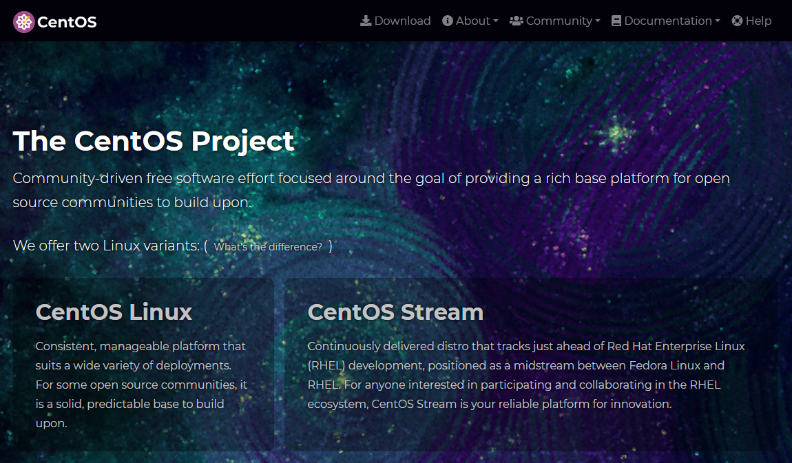

# Work-case 2: Робота з гіпервізором
В цьому ворккейсі було розглянуто гіпервізор, його призначення та основні функції.

Роботу виконали студенти групи БІКС-13:\
Гринь Дмитро та Ілля Негусєв

## 1. Що таке гіпервізор?
**Гіпервізор** або **Монітор віртуальних машин** — комп'ютерна програма або обладнання процесора, що забезпечує одночасне і паралельне виконання декількох віртуальних машин, на кожній з яких виконується власна операційна система, на одному фізичному комп'ютері.

Розглянемо гіпервізори II типу, тому що саме з ними нам доведеться працювати. Інакше, їх ще називають "гіпервізорами на рівні ОС", тому що вони працюють як ПЗ в середовищі основної ОС. Серед найпопулярніших можна виділити: 
- VirtualBox, який розробляється компанією Oracle. Його головні переваги: безкоштовність, непоганий функціонал та підтримка багатьох операційних систем.
- VMWare Workstation. Цей гіпервізор працює швидше та має більш якісний функціонал, але поширюється за певну плату.
- Hyper-V. Розробляється компанією Microsoft та поширюється разом із Windows Pro, Enterprise або Education.

Гіпервізори найчастіше використовуються спеціалістами IT для детального дослідження систем і програмного забезпечення. 

В нашому випадку, ми працюватимемо в Oracle VirtualBox, оскільки це компромісний варіант між VMWare Workstation та Microsoft Hyper-V. Завантажити його можна з офіційного сайту [VirtualBox](https://virtualbox.org)

## 2. Робота з гіпервізором. VirtualBox.
### Етап 1. Інсталяція гіпервізора.
Оскільки наша хост-машина використовує операційну систему Windows, ми повинні завантажити VirtualBox для **"Windows hosts"**. Сам процес інсталяції VirtualBox досить інтуїтивний, тому на ньому загострювати питання ми не будемо.

### Етап 2. Вибір дистрибутива.
На нашій віртуальній машині ми використовуватимемо ОС Linux. Це операційна система з відкритим вихідним кодом, на базі якої розроблено велика кількість дистрибутивів. Є як маловідомі, так і більш популярні, якими користується велика кількість користувачів. З найвідоміших можна виділити: Ubuntu, Debian, Fedora, Mint.
В нашому випадку ми будемо використовувати дистрибутив **CentOS**, яка більше спеціалізується як серверна ОС. Дистрибутив CentOS має свій [власний сайт](https://www.centos.org/) і поширюється безкоштовно, тому завантажити його не буде проблемою. В цьому ворккейсі будемо використовувати версію дистрибутиву **CentOS Stream 9**.

### Етап 3. Створення віртуальної машини.
Для того, щоб створити нову віртуальну машину, у менеджері VirtualBox потрібно натиснути кнопку "Створити". У вікні, що відкрилось, необхідно вказати назву машини, шлях розташування її файлів та вибрати потрібний ISO-образ диску операційної системи. VirtualBox автоматично розпізнає потрібний тип та версію операційної системи, проте в деяких випадках це потрібно буде зробити власноруч. 

На наступній вкладці необхідно визначити кількість ОЗП та ядер процесора, які будуть використовуватися для віртуалзізації. Для нашої операційної системи вистачить 4 ГБ ОЗП та два ядра процесора. Також на цій вкладці є чекбокс "Enable EFI", який додає підтримку Extended Firmware Interface (EFI) у вірутальну машину, але нам його вмикати не потрібно. 

Далі нам потрібно визначити розмір віртуального жорсткого диску, на який встановлюватиметься операційна система. Оскільки наш дистрибутив не потребує багато місця на VHD, ми можемо виділити ~30Гб на машину, або вибрати вже існуючий диск (якщо такий є). 

На наступній вкладці буде показані налаштування, які ми зробили. Перевіряємо їх, та натискаємо "Закінчити".
Після створення віртуальної машини, її можна додатково налаштувати. Для цього в боковому меню вибираємо потрібну машину, та натискаємо кнопку "Налаштування". Тут можна налаштувати назву та віртуальні компоненти системи, а також створити "спільні" теки, за допомогою яких можна передавати файли з віртуальної системи до системи хоста, або навпаки. Наприклад, ось так виглядає вкладка "Аудіо", де можна вибрати який саме аудіо-контролер використовуватиметься у віртуальній машині, а також ввімкнути або вимкнути ввід/вивід аудіо віртуальної машини. 

### Етап 4.1. Інсталяція дистрибутиву CentOS з графічним інтерфейсом.
Під час запуску віртуальної машини, вона завантажиться з ISO-образу операційної системи. Нам потрібно вибрати пункт **"Install CentOS Stream 9"** або **"Test this media & install CentOS Stream 9"**. Останній варіант також перевірить носій, на якому знаходиться ISO-образ системи, на наявність помилок, але в нашому випадку його можна не використовувати.

Наступним етапом є вибір мови користувача, на якій буде відображатись текст у програмах. Після вибору мови відкриється інша вкладка, де можна буде налаштувати все необхідне: метод вводу, часовий пояс, джерело встановлення (звідки встановлюватиметься система), набір передстановлених програм, налаштування диску, мережі, дампів ядра та профілів захисту, а також налаштування облікових записів звичайних користувачів та root.

Після первинного налаштування потрібно натиснути "Почати встановлення". Процес інсталяції займає деякий час, зазвичай від 15 хвилин до години. В кінці встановлення системи потрібно буде перезавантажити віртуальну машину.

### Етап 4.2. Інсталяція дистрибутиву CentOS з текстовим інтерфейсом, з подальшим встановленням графічних інтерфейсів Gnome та KDE.
На відміну від попередньої інсталяції, зараз нам потрібно встановити мінімальну версію системи. Для цього на етапі попереднього налаштування системи необхідно вибрати замість "Server with GUI" пункт "Minimal install"

Після встановлення операційної системи в нас буде тільки командний рядок, за допомогою якого потрібно виконати наступні дії:
- Оновити всі компоненти операційної системи за допомогою команди `dnf update`
- Визначити потрібну групу компонентів за допомогою `dnf grouplist`. Нам потрібна група компонентів **Server with GUI**
- Встановити потрібну групу
- Зробити графічний інтерфейс стандартним інтерфейсом операційної системи

Тепер при запуску системи у нас автоматично запускатиметься графічна оболонка Gnome.

Якщо нам потрібно встановити іншу оболонку (в нашому випадку KDE), тоді необхідно виконати наступні дії:
- Додати репозиторій `epel` у пакетний менеджер dnf. Варіанти встановлення цього репозиторію можна знайти [тут](https://docs.fedoraproject.org/en-US/epel/)
- Оновити метадані з репозиторіїв за допомогою `dnf update`
- Встановити компоненти з групи **"KDE Plasma Workspaces"** та **"base-x"**
- Перезавантажити систему

В меню вибору користувача, справа знизу є значок "шестірні", де можна вибрати необхідну графічну оболонку. Вибираємо **Plasma (Wayland/X11)** та входимо в обліковий запис користувача. 

**Тепер ми можемо користуватись графічною оболонкою KDE!** На відміну від оболонки Gnome, яка більш схожа на інтерфейс операційної системи **macOS**, KDE більш схожа на інтерфейс ОС **Windows**. 
Також KDE можна сильніше кастомізувати за допомогою вбудованих додатків, тоді як для кастомізації Gnome в більшості випадків потрібно завантажувати різні аддони, які можуть бути застарілим або некоректно працювати.

## Висновок
В цьому ворккейсі ми працювали з **VirtualBox** — безкоштовномим гіпервізором від компанії Oracle, завдяки якому створили дві віртуальні машини, які використовують операційну систему **CentOS Stream 9**. Під час виконання цього ворккейсу були розглянуті питання створення віртуальних машин та встановлення на них операційної системи CentOS, використання пакетного менеджера `dnf`, а також графічних оболонок KDE Plasma та Gnome.
